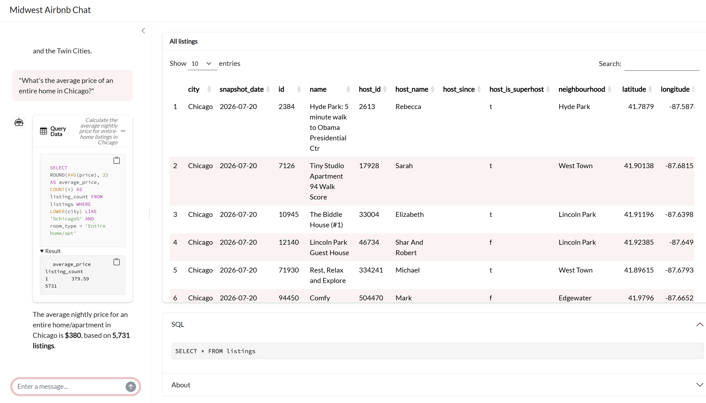
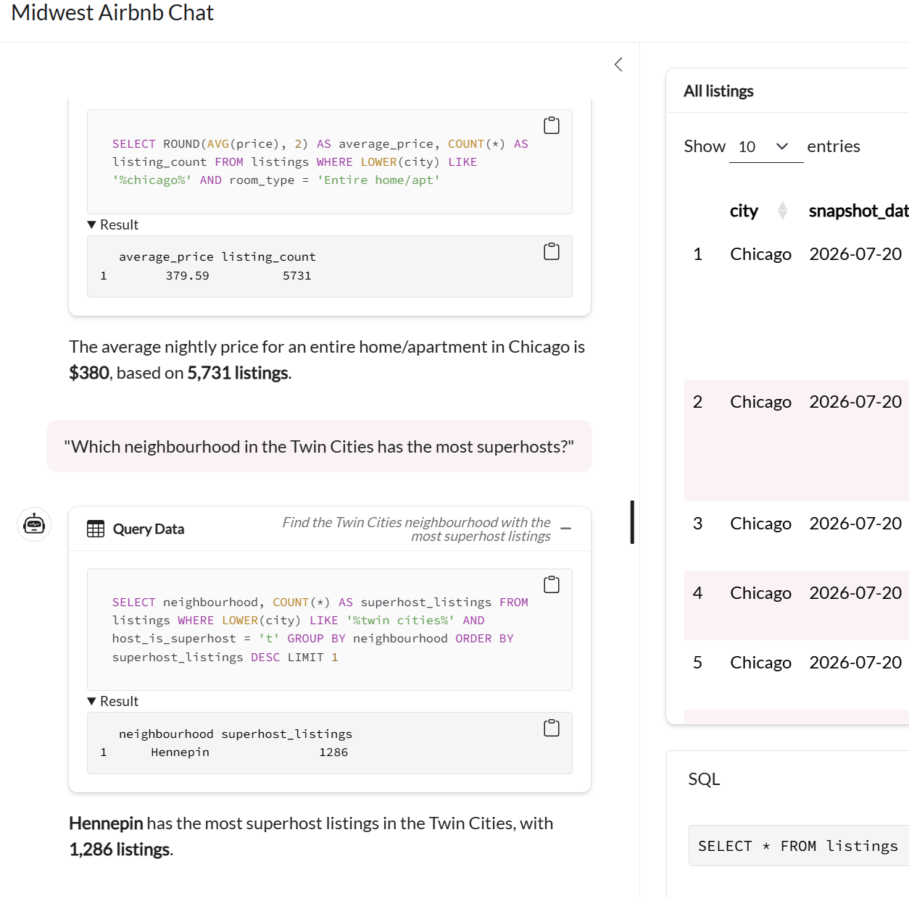
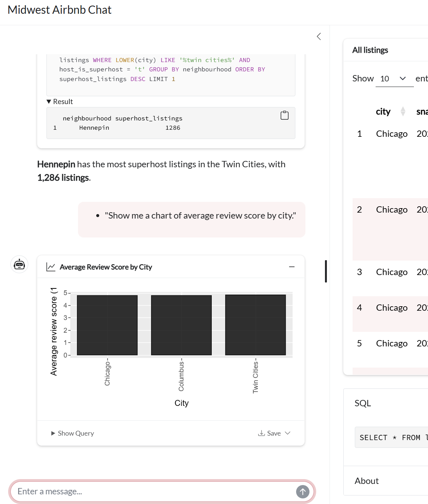

# ISA 401 Midwest Airbnb Chat

**Ask a question in plain English, get the SQL and a table back**

A [querychat](https://github.com/posit-dev/querychat) app built in ISA 401 (Miami University) on Airbnb listings from [Inside Airbnb](http://insideairbnb.com/), rebuilt from the Job Scout Chat starting point for Assignment 05, deployed to [Render](https://render.com) from a GitHub repository, and then improved with a custom theme, an About section, and a visible SQL panel.

**Live app:** (`https://midwest-airbnb-chat-sy99.onrender.com`)

---

## What is this app?

The app connects to a SQLite database (`data/midwest_airbnb.db`), hands the `listings` table to querychat, and lets an LLM translate your question into SQL. Every answer shows the query it ran in the SQL panel below the results table, so you can check the logic and reuse the SQL yourself. Ask it to filter listings, run aggregate queries, or draw a chart, since all three (`filter`, `query`, `visualize`) are enabled.

**Example queries:**
- "What's the average price of an entire home in Chicago?"
- "Which neighbourhood in the Twin Cities has the most superhosts?"
- "Show me a chart of average review score by city."

(Screenshots of these three running in the live app are below, under **Example Questions**.)

## Example Questions

Three questions run against the live app, one exercising a filter, one an aggregation, and one the visualize tool:

1. **"What's the average price of an entire home in Chicago?"**
   

2. **"Which neighbourhood in the Twin Cities has the most superhosts?"**
   
3. **"Show me a chart of average review score by city."**
   
---

## Dataset Information

**Dataset:** `listings` table in `data/midwest_airbnb.db` (14,887 rows, 29 columns)
**Source:** [Inside Airbnb](http://insideairbnb.com/) snapshots of three Midwest markets: Chicago (`2026-07-20`), Columbus (`2026-07-23`), and the Twin Cities metro (`2026-07-21`), combined into one table with a `city` column recording which snapshot each row came from
**Data dictionary:** `data/data_desc.md` (started in class; completed in Assignment 05)
**Query rules for the LLM:** `data/extra_instructions.md` (one starter rule; four more added in Assignment 05)

### Key Fields

| Field | Description |
|-------|-------------|
| `city` | `Chicago`, `Columbus`, or `Twin Cities` (the latter covers the whole Minneapolis-St. Paul metro) |
| `price` | Nightly price in U.S. dollars, with `$` and commas removed |
| `room_type` | `Entire home/apt`, `Private room`, `Hotel room`, or `Shared room` |
| `neighbourhood` | Inside Airbnb's cleaned neighborhood or community area name |
| `host_is_superhost` | Text `'t'`/`'f'`, not a true boolean; 25 rows are `NULL` |
| `review_scores_rating` | Guest rating on a 1-to-5 scale; `NULL` for 1,761 listings with no reviews yet |

See `data/data_desc.md` for the full 29-column dictionary, including two columns (`host_since`, `instant_bookable`) that are entirely `NULL` in this extract.

